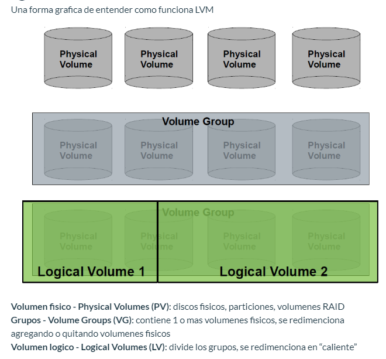
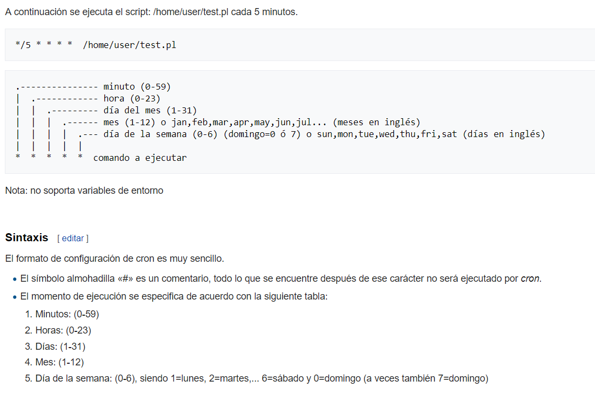

# Administrador de Servidores - Platzi
- **GNU/LINUX** es el sistema operativo que es la mas usada en cuanto a los servidores.

### Manejo de Sesiones Remotas con Tmux y SSH.

- lo mas recomendable es guardar las llaves SSH en la carpeta:
 > .ssh/

- En vez de conectarnos **asi**:
    _$ ssh -i ~/.ssh/platzi.pem ubuntu@54.196.172.97_

    quisiera conectarme **asi**:
    _$ ssh platzi_

    deberias configurar **ASI**:


- *Ademas que es la manera mas segura de conectarse mediante llaves ssh :*
  - crear un archivo config, dentro de .ssh/
  - Dentro de **config** escribimos:
    ```
    Host Platzi
        Hostname 54.196.172.97 (cualquier ip)
        Port 22
        User ubuntu
        IdentityFile ~/.shh/platzi.pem
    ```
  - una vez guardado, podemos ejecutar:
    - _$ ssh platzi_

### Tmux

- atajos de teclado para TMUX, [aqui](http://www.sromero.org/wiki/linux/aplicaciones/tmux).

- Comandos rapidos:
  - **(CTRL + b)  c :** -> crea una nueva instancia de terminal.|
  - **(CTRL + b) n :** -> es el numero de instancia que quiero ir.
  - **man tmux :** mas informacion acerca de los atajos de teclado.
  - **(CTRL +b) " :** divide la ventana actual _VERTICALMENTE_  
  - **(CTRL +b) % :** divide la ventana actual _HORIZONTALMENTE_
  - **(CTRL +b) o :** selecciona la siguiente terminal cortada, en la actual ventana.
  - **(CTRL +b) d :** desconecta la sesion de tmux, y la guarda temporalmente.
  - **tmux attach :** restaura la session de terminal guardada.

### Directorio de archivos en linux

- todo en el mundo linux (GNU-LINUX) esta representado como un archivo.

```
/bin, archivos binarios de los usuarios del sistema.
/boot, guarda los archivos del arranque del sistema.
/dev, guarda las definiciones de todos los dispositivos.
/etc, archivos de configuración del sistema.
/home, se almacenan los archivos de cada usuario.
/lib, almacena las librerías del sistema.
/lib64, almacena las librerias del sistema de 64 bits.
/lost+found, espacio temporal donde se guardan datos que se recuperan despues de la caida del sistema.
/media, cuando montamos en el sistema dispositivos, los podemos ver en esta carpeta.
/mnt, cuando montamos en el sistema dispositivos, los podemos ver en esta carpeta.
/opt, almacenas los programas instalados de terceros.
/proc, sistema de archivo virtual que lo crea y destruye el sistema. Contiene informacion del mismo. (forma anarquica)
/root, almacena los archivos del super usuario Root.
/run, datos variables en tiempo de ejecucion. Informacion del sistema desde el ultimo booteo.
/sbin, archivos binarios del administrador.
/srv, archivos de datos especificos para cada servicio instalado en el sistema.
/sys, evolucion de /proc pero localizado de forma jerarquica.
/tmp, almacenamiento de archivos temporales .
/usr, programas instalados por defecto.
/var, se utiliza para guardar archivos de logs, backups, servidor web.

```

- El sistema Linux, **esta compilado de forma dinamica**, es decir, las librerias son necesarias para correr cualquier Binario.
  - ejm: _FIREFOX necesita los binarios minimos para instalarse, sino, simplemente no se va a poder instalar_
- El sistema windows tiene una forma de compilacion estatica, ya que los instaladores tienen todo el programa ahi, incluido instaladores, eso incrementa el tamaño del instalador.
- el directorio **/root** carga con el sistema base inicial, por eso tambien no se encuentra en /home.
- cual es la diferencia entre **/bin** y **/sbin** ? es el PATH, el **/sbin** esta listo para poder ser utilizado para un usuario ROOT, o hacerse pasar por ROOT al ejecutar un determinado comando (ejm):
> /sbin/ifconfig (para un usuario sin privilegios de poder utilizar ese comando).
- para saber donde esta instalado un determinado PAQUETE (PROGRAMA) (ejm):
```
# dpkg -L firefox

```
- **/var/mail** -> se envian los correos del sistema localmente.
  - **/var/log** -> todos los reportes del sistema. (logs.)

- el directorio mas importante : **/etc**
  - estan todos los archivos de configuracion del sistema.
  - No es el directorio mas pesado, pero el mas importante.

- **/boot** se configura el sector de arranque, es la pieza mas importante para arrancar el sistema, (UEFI,GRUB, aqui) sin esto el sistema queda irreparable.
  - este directorio es el unico, que no se encuentra encriptado cuando todo el sistema lo esta.

### Repositorios

- son la fuente de Software oficial de una determinada distribucion, ademas se puede agregar manualmente otros No oficiales.

- con la opcion: **_# apt-get update_** actualiza toda la lista de configuraciones de paquetes.

- cada uno de los repositorios, existe con una llave (GPG).
- la llave GPG permite saber si un repositorio es confiable o no.
- **# apt-cache search keyring** busca los anillos de seguridad, por lo general estan instalados por defecto, sino, instalarlos, en un servidor es preferible instalar las **versiones estables**.

### Como instalar paquetes

- los paquetes en la mayoria de las distribuciones, ya estan compilados, lo que hace uno es simplemente `descargarlos`.

- **_# apt-get_** me permite instalar paquetes o administrar los paquetes.
  - **# apt-get remove nombre-paquete** : elimina el paquete nombrado.
  - **# dpkg -P nombre-paquete** : elimina todo el programa mas archivos relacionados, pero no quita los programas instalados por _DEPENDENCIA._

- **aptitute:** es un programa que me permite administrar o instalar componentes (similar a synaptic).
    - **/** para buscar componentes.
    - **+** para marcar el paquete instalar paquetes (tambien todo lo que se necesita instalar).

### Empaquetar y comprimir Archivos.

- *Empaquetar:* es agarrar muchos archivos y directorios y dejarlos todos en un solo archivo.

- *Compresion:* Agarrar ese archivo (empaquetado) y comprimirlo.

- ejm:

  - para empaquetar la carpeta doc/, llamandolo _doc.tar_

    >**# tar cvf doc.tar doc/**

  - para compresion, utilizo gzip (le agrega un .gz al archivo):

    >**# gzip -9r doc.tar**    

- para descomprimir:

    >**# tar xvfz doct.tar.gz**

- el comando **tar** me mantiene los permisos de los archivos descomprimidos.

- el sistema automaticamente crea un punto _.gz_ despues de **X** tiempo (ya sea Ngix,apache,postgresql) en el directorio **/var/log**
(siempre pone los _logs_ comprimidos).

### Compilar

- en debian y ubuntu, estan precompilados los paquetes, solo hay que bajarse los binarios.

1. se tiene que instalar:
  - **_# apt-get install module-assistant_** (me permite realizar algunas configuraciones).

  - - **_# m-a --help** (es una ayuda para compilar librerias o modulos que van directamente al kernel).

  - - **_# m-a prepare** (Busca, dependiendo del kernel que tengamos, y va a instalar una serie de paquetes necesarios para compilar.

2. Agregar la funte de datos, en el **/etc/apt/sources.list**:

3. descargamos la fuente:

  -   - **_# apt-get source paquete-a-descargar_** (me permite descargar todo lo relacionado a ese programa).

  -   - **_# apt-get built-dep paquete_** (me permite descargar todas las dependencias que le falta al determinado programa).

  -   - **_# apt-get source -b paquete-a-descargar_** (me permite compilar el determinado programa).

### Documentacion.

- **# zless archivo.gz** comando que me permite visualizar un archivo comprimido sin descomprimirlo.
- los comandos **man** e **info** me permiten saber la Documentacion de un determinado programa.
  - para busqueda, apretar el signo **_/_** dentro del comando  ´man.´

  - Todos los programas deben tener Documentacion.
### Administrar Discos y particiones en Linux.

- Las particiones aparecen para segmentar un disco.

- Las particiones y discos duros en linux **se pueden montar** en caliente, similar a un pendrive USB.

- Comandos:
  - `dmseg` **->** lista el buffer del núcleo.
  - `fdisk -l` **->** lista de las particiones del disco, tambien me permite **particionar** un disco.
    - este comando actua sobre un disco duro (/dev/sdX), **NO** sobre una particion.

Notas importantes
Parámetros fdisk.
n-> nueva partición
d-> eliminar partición.
t-> modificar tipo de partición.
q-> salir sin guardar.
w-> salir y guardar los cambios. (**guarda los cambios!!**)


**NOTA**: mientras no se guarden los cambios, no afecta al disco.
- dentro de una particion logica **(extendida)**, se pueden crear mas particiones (_actua como un contenedor_).

### Formateo y Montaje de particiones

- El sistema de archivos es la forma como realmente se guardan los datos en la particion.

- no existe un solo sistema de archivos que podamos usar, la idea siempre es saber la ventajas de cada uno de ellos.

- el comando **mkfs** le da el formato a una determinada particion. (ejm):
  - **# mkfs.vfat /dev/sdx1** _//lo formatea en FAT32(usadas en USBs windows)_
  - **# mkfs.ext3 /dev/sdx2** _//lo formatea en EXT3 (linux)_

- para montar un particion de forma **MANUAL**:

```
  mount /dev/sdx /direccion/donde/montar**
```

- para desmontar un particion de forma **MANUAL**:

```
  umount /direccion/donde/montar**
```
- el formato **ext4** reserva un espacio del *5%* de disco cuando se apaga el sistema (_/lost+found_), donde guarda unos nodos que es una forma en la cual salva la informacion.

- antes de montar una particion, se debe asegurar que dicha particion cuente con un **formato**, sino, no se podra montar.

- el formato **ZFS** no tiene soporte en linux, debido a las licencias.

- para montar las particiones de forma **AUTOMATICA**:

- el comando **df -h** muestra el espacio utilizado por las particiones en el sistema.

  - editar el archivo **/etc/fstab**:(existen varias formas de editar dicho archivo.)
  - ```
    /dev/sdb1 /donde/montar ext4 defaults,discard 0 0

    ```
  o tambien:

  -   ```
      UUID:xxxxxxxxx /donde/montar extX 0 0

      ```

  -   una vez agregado, solo debe ejecutarse, la siguiente linea para montar la particion:
      ```
      # mount /donde/montar

      ```


### Administracion SWAP

- la particion SWAP, esta dispuesta como reemplazo a la memoria RAM.

- lo recomendable es ponerle 5 Gb de Swap como minimo, pero si existe la posibilidad de incrementar la RAM, hacerlo.

- la memoria SWAP a comparacion de la RAM, **es lenta**, al usarlo reduce la velocidad del procesamiento del sistema, y ademas la memoria _RAM funciona a la misma velocidad del procesador._

- comando **free**:
  - me avisa el estado de la memoria RAM en general.

- recomendable instalar el programa **_htop_**:
  - **# apt-get install htop**
  - muestra informacion mas completa.
- cuando ya se esta por llenarse la memoria RAM, es preferible crear una particion de SWAP, se crea con el comando **fdisk.**
  - una vez creado, se formatea con la siguiente instruccion:
    - **# mkswap /dev/sdx5** (suponiendo que la particion es la _sdx5_)
  - luego, Activamos la nueva particion Swap:
    - **# swapon /dev/sdx5**
  - para desactivar la particion swap:
      - **# swapoff /dev/sdx5**

### Generar imagenes de discos duros.

- Comando **DD**: es una herramienta que me permite crear/copiar informacion de un lugar a otro.
- la instruccion _cp -ra /var /tmp/var_:
  - *-r* copia recursivamente.
  - *-a* preserva los permisos, propietarios de archivos,etc.

- la instruccion _du -sh_:
  - *-s* muestra el total de cada argumento.
  - *-h* le da un formato mas entendible (en MB,KB,GB,etc).

- Para sacar una imagen de una particion, primero debe:

  1. Desmontar la particion:
    - **# umount /mnt**
  2. sacar imagen de otra particion:
    - **# dd if=/dev/sdb6 of=/var_new/backup_sdb6 bs=1M**
      - opcion **bs**: va a crear bit a bit la imagen del disco duro.
      - **if**: Input File = particion a crear
      - **of**: Onput File = lugar donde poner la imagen, ademas del nombre de la imagen creada.
- comando **wget [Url]**: me permite descargar desde la terminal, archivos.

#### para montar una ISO.

- **# modprobe loop**: el comando _modprobe_ habilita el modulo LOOP, para CD-ROMS.

- **# mount debian-9.iso /tmp/ -o loop**: monta el CD-ROM correctamente.

#### que tan rapido es el disco en linux?

- primero creamos una imagen de 100 MB:
  - **# dd if=/dev/zero of=/zeros100M bs=1M count=100** _//_ genera un archivo de 100 MB.
    - _NOTA:_ **/dev/zero**: Genera un archivo lleno de ceros,en este caso llamado _zeros100M_.
      - para ver el archivo: **# hexdump zeros100M**
  - ejecuto el comando: **sync**: para que sincronize todos los cambios del disco duro, a veces el disco duro genera cache.
  - si yo quisiera _leer_  los 100 MB del disco duro para ver el rendimiento o hacer *benchmark* (pruebas de rendimiento), seria:
    - **# dd if=zeros100M of=/dev/null bs=1M**
      - _NOTA:_ **/dev/null**: es como un dispositivo denominado _HOYO NEGRO_, todo lo que se mande ahi, va a desaparecer.
    - una vez que termina,genera informacion sobre el rendimiento de dicho proceso.

### Administrar Particiones GPT.
- Existen 2 formas de arrancar el sistema, por UEFI, o MBR.
  - _MBR_ es mas antiguo, la BIOS busca en los primeros 512Mb del disco, para arrancar, solo permite 4 particiones primarias.
  - _UEFI_ o _EFI_, nacio como una extension de una interfaz para brindar seguridad, permite 128 particiones de disco duro.

    - las particiones creadas por distribuciones como debian e Ubuntu ya esta soportadas en UEFI, pero se recomienda deshabilitar la opcion _SECURE BOOT_ en el menu de *UEFI*.

  - **como saber que tipo de arranque tiene el disco duro**:
    - Con la instruccion: **#fdisk -l /dev/sda**
      - NOTA: si aparece la linea: _disklabel type: dos_; es de tipo MBR.
- el comando **gdisk** nos permite manipular particiones GPT, asi como _fdisk_ nos permite manipular particiones dos (MBR).
  - para instalar: **apt install gdisk**
  - **# gdisk -l /dev/sdc** _//_ nos muestra informacion, referida a particiones GPT, en dicho disco duro.
  - Para crear una particion, existe una gran similitud con el mecanismo del comando _fdisk_.

#### Administrar Arranque del sistema GRUB  
- Es el sistema de gestor de arranque, creado por GNU, denominado _bootloader_.
- La ultima version modificada data del 2012.
- muchas veces el grub, viene a ser un dolor de cabeza, si se llega a dañar.
- los archivos que se encuentran en **/etc/grub.d/** (los cuales si pueden ser modificados), luego de compilarse, generan un archivo unico, ubicado en **/boot/grub/grub.cfg**, es _RECOMENDABLE_ no modificar ese archivo.

- El GRUB siempre va en los primeros 512 bytes del disco Duro.

- siempre es recomendable sacar un backup del GRUB, para esto hacemos la siguiente instruccion:

  -**# dd if=/dev/sda of=/root/mbr_backup bs=512 count=1** _//_ donde *bs=512* vienen a ser los primeros 512 bytes del disco MBR.

- tambien existe un comando asistente para modificar el GRUB:
  - **# update-grub2**: comando que nos permite compilar todos los archivos de _/etc/grub.d/_ y arrancar.
- **# grub-install /dev/sda** _// permite instalar el grub en el disco pasado como argumento._


### Apagar Servidores de Forma Remota.

- **# shutdown -r now** _// va a reiniciar el servidor._
- **# shutdown -h now** _// se apaga el servidor, fisicamente._

- En sistemas como ubuntu, debian y Red Hat, centOS, existe el comando llamado **systemctl**:
  - **# systemtcl --help** _// me muestra las opciones disponibles._
  - **# systemtcl reboot** _// reinicia el servidor._
  - **# systemtcl poweroff** _// apaga el servidor._

### Administrar Discos Duros con LVM



- **LVM** nos permite realizar una configuracion de discos duros, que nos permita administrar el espacio de almacenamiento del servidor.

- Es una **MUY BUENA PRACTICA** que se debe utilizar, y   porque:
  - Me permite agrandar un disco duro en tiempo de ejecucion.
  - Me permite agregar mas discos duros.
  - Tener mas particiones o discos duros diferentes.
  - En los servidores, los LVMs son muy usados.
  - Tambien nos permite tener SNAPSHOPs.
  - Adicionalmente se puede utilizar con RAID y multiples configuraciones.

- Primeramente,instalamos la aplicacion LVMs:
- **# apt-get install lvm2**
- NOTA: Ante todo se debe crear la *partición* y darle el formato Linux LVM (8e) con **fdisk**.
- **A PARTIR DE AQUI** se debe desmontar cualquier particion, ya que sino,aparecera el error de que se encuentra ocupado (busy).
- **# pvcreate /dev/[nombre de la partición o disco]** Este comando agrega la partición a los volúmenes físicos del LVM.
- **# pvs** _//_ me permite listar los discos duros con LVM.
- **# pvremove /dev/[nombre particion o disco]** _//_ me permite eliminar un lvm.
- **# pvscan** _//_ cual es la configuracion actual, en el sistema.

- **# pvmove /dev/origen /dev/destino** _//_ mueve los datos desde una particion origen a una destino, para que funcione,debe tener el suficiente tamaño.

- Luego de estos pasos, se puede crear un **Grupo Logico**, un grupo logico me permite _tener una especificacion fisica_, para luego sacar los volumenes logicos.

- El grupo logico (o volumen) de *LVM* es como si creara una *nueva particion.*

- EJM: un grupo para manejar las bases de datos.
- **# vgcreate nombre-grupo /dev/[particion o disco a agregar]** _//_ cual es la configuracion actual, en el sistema.
- **# vgs** _//_ me permite listar los grupos de LVMs creados.
- **# vgextend nombre-grupo /dev/[particion o disco a agregar]** _//_ me permite agregar un disco o una particion, a un determinado **GRUPO** LVM.
- **# vgdisplay** _//_ me muestra informacion sobre los grupos de LVM creados.
- **# vgreduce nombre-grupo /dev/[particion o disco a agregar]** _//_ me permite *QUITAR* un disco o una particion, a un determinado **GRUPO** LVM.
- para crear un volumen logico (LV):
  - **# lvcreate -n postgres -L 10g databases** _//_ con esta instruccion, estoy creando un volumen llamado postgres, de 10GB, desde el GRUPO _"databases"_ previamente creado.
  - **# lvs**   _//_ visualiza los volumenes creados.

- en resumen:

  **# pvs**: me permite visualizar particiones LVM .
  **# vgs**: me permite visualizar particiones LVM virtual (denominada GRUPOS, pueden estar conformadas por varias particiones  o discos).
  **# lvs**: me permite visualizar la particion que voy a MONTAR.
- Dando formato:
  **# mkfs.ext4 /dev/databases/postgres**: _//_ dandole formato a mi particion (volumen) que voy a montar.
  - **Si quisiera extender el tamaño de esa particion:**

    - **# lvextend -L +10G /dev/databases/postgres** _//_ se extiende en 10GB mas, esa particion LVM.
    - pero para completar esa extension, se debe hacer:
    - **# resize2fs /dev/databases/postgres** _//_ se confirma la extension de tamaño de una particion.
    - si ya no tenemos espacio libre, para agregar a un particion, solo debemos agregar mas con la instruccion:
      - **# vgextend nombre-grupo /dev/[particion o disco a agregar]**

### Arrancando el sistema, RUNLEVELS, SYSTEMD

- Todo sistema que tenemos en linux, tiene una forma de Arrancar.
- En linux por defecto, existen 6 Niveles que diferentes programas arrancan.
  - EJM: _cada vez que necesitamos habilitar el IPTABLES, debemos habilitar la interfaz de red, y para eso cargar el modulo, para este el kernel,etc._

- por defecto, los 6 niveles de servicio son:
  1. Modo usuario.
  2. Modo multi-usuario.
  3. Soporte sin Red.
  4. Soporte Con Red.
  5. Interfaz grafica.
  6. Reinicio.

- En Linux por defecto han existido 6 niveles que todos los programas arrancan, se pueden ver en las carpetas _[/etc/rc0.d]_ hasta _[/etc/rc6.d]_.
  - *rc0.d* : alto o cierre del sistema (apagado del sistema.)
  - *rc0.d* : modo monousuario (me permite ver si el sistema esta en modo recovery o recuperacion).


- Dentro de estas carpetas los archivos con **S** son de _arranque_ y **K** son de _salida_.

- Hace algunos años aparecieron diferentes sistemas adicionales para poder arrancar el sistema.

  - El comando **# runlevel**, me dice que en nivel de ejecucion estoy arrancando actualmente.
  - El comando **systemd** me permite saber, todo el arbol de procesos y decir simplemente, que ciertos procesos _X_ dependen de otros procesos _Y_.

- **NOTA**: actualmente se considera que modificar manualmente _/etc/init.d/nombre-servicio_ (*son Scripts*), es antiguo, ahora fue reemplazado por _systemd_, por medio de **systemctl**.

  - El programa **systemctl** me interactua con el comando **systemd**.
    - **# systemctl** _//_ me permite observar todos los servicios que yo tengo activados y el estado actual.

    - **# systemctl list-dependencies sshd** _//_ me muestra las dependencias del servicio *ssh*.

    - **# systemctl show ssh** _//_ Instruccion que sirve para ver el estado del servicio _nginx_.

    - - **# systemctl cat nginx** _//_ Puedo ver Donde esta Arrancando el servicio, y cual es el _script_ que el utiliza.

    - **# ps aux | grep ssh** _//_ Me permite ver los servicios que estan corriendo.

    - **# systemctl status ssh** _//_ Me permite ver el _Estado_ del servicio.
      - **CGroup**: es la parte de seguridad donde esta corriendo.

- La Instruccion: **# kill -9 PID** _//_ Mata el proceso Respectivo.

#### como evitar que maten a un determinado servicio:

- **# systemctl cat cron** _//_ Me permite saber, en donde esta el script del servicio.

- abrimos con un editor el servicio:
  **# vim /lib/systemd/system/cron.service**
  editamos la directiva **[Service]** y ponemos debajo del resto:
    ```
    Restart=on-failure  //reiniara en caso de falla.
    RestartSec=2s    //reiniciara en 2 segundos.

    ```
- Ahora, se necesita Recargar el servicio:
    - **# systemctl daemon-reload**
    - **# systemctl restart cron**

- Por si acaso, poner :
  - **# systemctl --help** _//_ para verificar las opciones disponibles.

#### Deshabilitando un servicio al inicio del sistema:

  - - **# systemctl disable cron.service** _//_ desactiva el servicio cron, luego de reinicar el servidor.


### Uso de variables de Entorno, Bashrc,Profile

- `VARIABLES DE ENTORNO`: nos permiten configurar diferentes ambientes, desplegarlos, en contenedores nos permite pasar contraseñas, configurar opciones,etc.
  - Ademas, contiene los _paths_ donde busca los binarios.
    - EJM: **# GOOGLE="http://google.com"**
  - para mostrarlo:
    - **# echo $GOOGLE**
- el comando **# export** me muestra las variables que tengo en este momento en la sesion actual, de una a otra sesion, no comparte variables.
- En la variable **PATH** se encuentran las rutas donde se encuentran cada uno de los binarios del sistema, puede ser diferente dependiendo del usuario actual.

- En el script oculto **.bashrc**, mantiene y guarda la session del usuario actual, ademas es configurable (por tanto se pueden guardar _variables_).
  - este Script, afecta a todas las cuentas que se tratan de logear en el sistema.

- El Script **.profile**, es un archivo modificable, y afecta todo lo que tenga que ver con el _bash profile._ del usuario actual.

- el *PROFILE* general de todos los usuarios, se encuentra en: **/etc/profile** , tambien se la puede colocar un archivo de nombre _profile_ en **/etc/profile.d/**.

  - Al final del archivo, voy a a agregar la siguiente variable de ejemplo:

    > export HOME_DB="/tmp"

  - Guardo, hacemos `logout` del usuario _root_, y generamos una nueva sesion, reiniciando la configuracion de las variables de entorno, asi:
    - **# sudo su -** _//_ con el _-_, estamos confirmando que reiniciara cualquier cambio que hayamos hecho en las variables de entorno.


- tambien existe un **bashrc** general, para todo el sistema, se encuentra en **/etc/bash.bashrc**.

### pipes, redireccionamientos para LOGS.

los informes (logs) se encuentran en **/var/log**.

- La mayor parte del tiempo, los Sysadmins se la pasan viendo los LOGS, del sistema.

- el comando **less** se usa para visualizar archivos (logs), lo carga de manera completa, y con la tecla  _espacio_ se puede mostrar lentamente.

- el comando **more** tambien sirve para visualizar, lo carga de manera previa.

- el comando **grep** es la forma mas facil de buscar un contenido dentro de muchos archivos (EJM:).
  - **# grep -v "/js/"" prueba.txt** _//_ me mostrara las lineas que no contenga el contenido *"/js/"*.

- el comando **pipe** (tuberia), manda la salida de un comando a otro, tambien me permite encadenar salidas, de varios archivos.

- el comando **wc** me permite mostrar la cantidad de lineas, palabras y bytes que contiene un determinado archivo.

- el comando **awk** sirve para editar texto (es un lenjuage de programacion), es muy potente, una de sus funciones, me permite obtener columnas de una salida de comandos (EJM):
  - **# ls -l | awk '{print $1}'**
  - [tutorial mas completo sobre AWK](https://www.linuxtotal.com.mx/index.php?cont=info__tips_021)
- otros comandos:

  - **sort**: me permite ordenar de un manera, la salida
  - **uniq**: me elimina las lineas repetidas.
  - **<,>,>>,<<**: redirecciona la salida de un determinado comando.
  - **cat**: concatena el contenido de archivos, en uno solo.
  - **head**: por defecto me muestra las primeras 10 lineas de un archivo.
  - **tail**: me muestra las ultimas 10 lineas de un archivo, pero tambien me los puede mostrar en tiempo real, es decir, me muestra como va agregando en vivo nuevas lineas. (ejm):
    - **# tail -f archivo.log**

- En el archivo **/var/log/syslog** se muestra toda la informacion del servidor, que esta haciendo, si esta en linea, como se esta conectando, que servicios se estan iniciando, etc.

### Monitorear,Eliminar y establecer Prioridades en Procesos.

- En linux, todo es un proceso, todo lo que corre.
- El proceso es el que utiliza CPU y MEMORIA.
- Los procesos en linux estan encapsulados en sus respectivos usuarios.
- Es recomendable que, los procesos esten ejecutados por otro usuario que no sea **ROOT**, asi encapsulamos y protegemos el sistema, sobretodo de exponer al usuario _ROOT_.
- **# ps aux** Muestra todos los procesos que se encuentra corriendo el sistema.
- Todo proceso en Linux tiene un identificador **(ID)**. Ese ID es único.
- es mejor tener instalado el comando : **htop**, te muestra una informacion mas detallada de los procesos que estan corriendo.
  - _load average_: muestra el uso del sistema (3 columnas, al los 5 minutos, a los 10 minutos)
  - la tecla **f5**, me muestra el arbol de procesos, todos los procesos parten desde **/sbin/init**.
    - El comando **pstree** hace exactamente lo mismo, agregando la opcion: **-p** tambien mostrara el ID del proceso.

- Todo proceso en linux tiene un ID, y es unico.

- Si intento matar un proceso hijo (*con kill -9 PID*)(forma incorrecta de matar un proceso.), el comando padre volvera a reiniciar el proceso, a menos que, mate al proceso _PADRE_.

- Otra forma de reiniciar Procesos:
  - **# /etc/init.d/ssh restart**.

- en **htop**:
  - _F9_: me muestra en el laberal de la terminal, todas las señales que se pueden utilizar
- la instruccion **# kill -15 PID**, cierra de manera correcta un proceso.
- los procesos en linux, tiene prioridad (comando **nice**)
  - el valor **-20** es el valor de mayor prioridad en el sistema, los valores negativos son los que tiene mayor prioridad,
  - con la intruccion: **# nice -n0 apache2** _//_ le estamos diciendo al sistema, que le de mas prioridad al proceso *apache2*.

- el comando **top**, es la version mas _lite_ de Htop.
- Es recomendable, que al ejecutar un proceso, no sea con el usuario _ROOT_, y si con otro usuario, asi se protege la cuenta de administrador **root**.

### Enlaces Duros, simbolicos, y sistemas de Backups.

el comando **# du -sh *** me muestra cuanto pesa cada argumento (el * me agarra todos los posibles archivos y directorio de esa ruta.)

- Linux me permite crear como accesos directos a archivos o directorios.

- **Enlace Simbolico**: es un acceso directo o apunta hacia algun lugar, EJM:
  - `# ln -s /ruta/donde/quiero-apuntar nombre-del-enlace`

- varios directorios hacen uso de los enlaces simbolicos, ejemplo _/bin_.

- **Enlace Duro**: Apunta fisicamente al mismo archivo o directorio, por tanto, al modificar cualquier de ambos, estamos modificando el mismo archivo (EJM):
- El comando **# tree** lista el contenido de un directorio, en formato de arbol.

  - `# ln  /ruta/donde/quiero-apuntar nombre-del-enlace`
  - NOTA:
    - _solo se puede hacer enlaces duros de archivo, NO de directorios._
    - _se permite crear enlaces duros, si se ENCUENTRAN EN LA MISMA PARTICION o DISCO DURO, ya que se asocia con el mismo NODO._

### Manejo de Usuarios y Grupos.

- Linux es un sistema multi-usuarios.
- En distribuciones derivadas de Debian (Ubuntu,Mint,Kali), se usa comunmente la instruccion **# adduser nombre-usuario**.
  - El Script **adduser**, por debajo utiliza, otro comando llamado: **useradd**, dicho comando es el que en realidad crea usuarios dentro del sistema.

- en el archivo **_/etc/passwd_**, se encuentran todos los usuarios del sistema.
  - estan separados por *:* y la primera parte es el nombre del usuario, seguido del ID, ID del grupo, directorio del usuario, tambien la ubicacion del bash.
  - la instruccion **/bin/false** indica que el usuario no puede _loguearse_ y no tiene derecho a una terminal.
  - todo usuario en el sistema

- Para loguearse desde la terminal, se realiza la siguiente instruccion:
  - `# su - nombre-usuario`
  - agregando ese signo *-*, estoy cargando un nuevo *entorno* en la misma terminal.
- el comando **#groups nombre-usuario** me indica, a que grupos pertenece el usuario actual.
- Un determinado usuario del sistema, debe pertenecer a los grupos respectivos para poder tener permiso de uso.
- Con la sintaxis: **#addgroup nombre-usuario nombre-grupo** puedo agregar un usuario a un grupo respectivo (EJM):
  - **#addgroup ubuntu sudo**
  - Cuando un usuario se agrega recientemente a un _grupo_ respectivo, este usuario se tiene que volver a loggear para poder usar los nuevos permisos que te da el dicho grupo.
- En el archivo **/etc/group**, se encuentran todos los _grupos_ existentes en el sistema.
- En el archivo **/etc/shadow**, se encuentran todos las _contraseñas_ encriptadas de los usuarios.
  - un signo **!**, significa que el usuario no tiene una contraseña.
  - tambien se le puede borrar la contraseña encriptada a un determinado usuario, editando este archivo **/etc/shadow**, agregando un _!_, por tanto, dicho usuario podra loguearse sin colocar contraseña alguna.

  - el comando **#addgroup [nombre-del-grupo]** crea un grupo en el sistema.

  - el comando **#deluser [nombre-del-usuario]** crea un grupo en el sistema.
    - internamente utilizar el comando **userdel**.
    - para borrar todo (usuario, grupo, y su directorio), se ejecuta el siguiente comando:
      - **#userdel -r [nombre-usuario]**

  - NOTA: el comando **getent** (GetEntry) que significa traer registro, permite acceder de forma directa a los distintos archivos _descriptivos_ del sistema y filtrar por parametros, sin necesidad de usar *cat* o *grep*.

  ```
  # getent passwd       // trae todos los registros contenidos dentro de /etc/passwd.

  # getent passwd ubuntu       // para ver solo el registro del usuario ubuntu dentro de /etc/passwd.

  ```
- para editar archivos de forma segura, se lo hace con el comando **visudo**, [aqui un tutorial de VISUDO](http://rm-rf.es/visudo-vipw-y-vigr-editando-ficheros-criticos-en-linux-de-forma-segura/)

- AVERIGUAR SOBRE LIMITES A LOS USUARIO O GRUPOS (servicio timeoutd, /etc/security/limits.d/timeoutd).

### Generar Backup de base de datos.

- Existen varias maneras de generar backups de base de datos.
- comando *sync* obliga al sistema, a guardar los cambios guardados en cache al disco duro.
- para la base de datos, postgres:
  1. se instala con: _# apt-get install postgresql postgresql-contrib_.
  2. Nos logueamos como usuario postgres: _# sudo - postgres_
  3. **_# psql_** _//_ entramos en modo editor de base de datos.

    - *\l* imprime en pantalla las bases de datos actuales.
    - *\l+* imprime en pantalla las bases de datos actuales y el tamaño que ocupa en disco (+ info).
    - *\q* salir.
  4. **pg_dump --help** _//_ me muestra las opciones del comando pg_dump, que sirve para realizar backups a las bases de datos (hacerlo como usuario postgres).

  5. **pg_dump [nombre-bd] > respaldo.2018.03.01.sql** _//_ (hacerlo como usuario postgres) se hace un backup completo de una base de datos, siempre es recomendable ponerle fechas.

      - este backup pesa menos que la original, eso es debido a que esta forma no genera los backups de los INDICES, solo genera sintaxis SQL.
- **dropdb [nombre-db]** _//_ borra la base de datos.
- **createdb [nombre-db] -0 [nombre-propietario]** _//_ crea la base de datos.
- ****
- _PARA COPIAR DESDE UNA BACKUP A UNA BASE DE DATOS:_
  1. **createdb [nombre-db] -0 [nombre-propietario]** _//_ crea la base de datos.
  2. **psql [nombre-db] < [nombre-backup.sql]** _//_ mando el backup a la base de datos creada.

### Uso de SOCAT y manejo de redireccionamiento de PUERTOS.

- Muchas veces se necesita redireccionar puertos de un lugar a otro, cambiar protocolos, hacer tuberias.
- el programa _SOCAT_ realiza varios de estas tareas, es un programa muy grande, la documentacion es bastante buena, es mas utilizado para redireccionar a otros puertos y equivar firewall o un proxy, como se configura:
  - instalar con: **# apt-get install socat**
**EJEMPLO:**

- Supongamos que tenemos la ip 172.31.28.228 donde carga el apache2 (puerto 80), y queremos que haga lo mismo en el puerto 8080. *(es decir, entro al http://172.31.28.228/8080 y me cargue apache2)*, por tanto, la configuracion con *SOCAT* seria:
  -**# socat TCP-LISTEN:8080,fork,reuseaddr TCP:localhost:80**
   _//_ Redirecciona todo el tráfico del puerto 8080 al 80.

- para esta prueba, utilizaremos el comando _netcat_, que nos permite varias cosas, para este paso, lo utilizaremos para levantar un servidor TCP de alguna informacion. :
  - **# apt-get install netcat-openbsd**

  - lo inicio con el comando **nc**.

  - **# nc -l 8080** levanto el servidor, le digo que me escuche en el puerto 8080 (puerto TCP), solo soporta una conexion al tiempo.

  - el comando **# netstat -an | grep 8080** me permite ver los puertos del sistema actual.

  - el comando **netstat** ya no esta soportado, el reemplazo es el comando **ss**.

  - Desde otra maquina ajena, ejecuto:
    - **# telnet 172.33.44.124 8080** _//_ y puedo enviar lo que yo quiero que llegue al servidor.

    - **# echo "hola como estas" | nc 172.33.44.124 8080** _//_ envio esa frase al servidor levantado, por el puerto 8080.

### Tareas Programadas y como monitorearlas

- *Tareas Programadas*: son de las cosas mas importantes en el sistema, ya que con ella podemos programar backups, borrar datos, agregar datos, mandar correos electronicos.
- **CRON** es un programa por defecto en la mayoria de distribuciones linux, sirve para agendar tareas en unas horas especificas (como un temporizador).



- el _crontab_ tiene 5 valores importantes,
  - **crontab --help** _//_ nos muestra los comandos disponibles.
  - **crontab -e** _//_ me permite editar el archivo crontab.
    - EJM:
      - **0 9 * * 1 date >> /tmp/date** _//_ guarda la fecha todos los lunes, a las 9:00 en el archivo date, en _/tmp/_
  - Para ver que el crontab cambio, podemos observar con la siguiente instruccion:
    - **# tail -f /var/log/syslog**
    - En ese archivo, se registra los eventos del sistema, incluido las ejecuciones de crontab.

- En el directorio **/etc/cron** se encuentra el lugar donde se puede configurar mas cosas de este comando.
  - Dentro de este directorio, existen tareas (scripts) ya creadas en carpetas como:
    - **cron.d/**
    - **cron.daily**
    - **cron.hourly*
    - **cron.monthy**
    - **cron.weekly**

- el comando **# locate [nombre]** me permite buscar archivos dentro del sistema.
